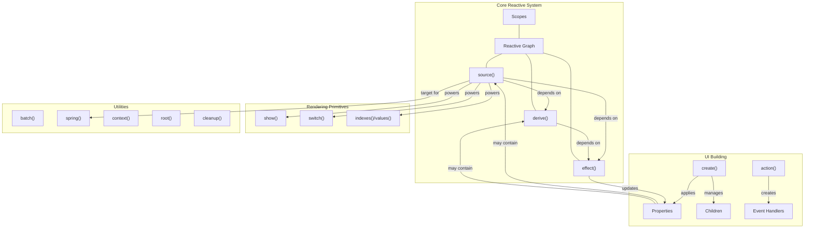
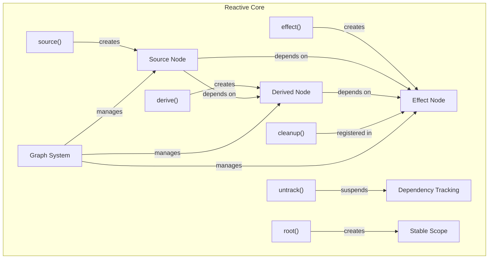
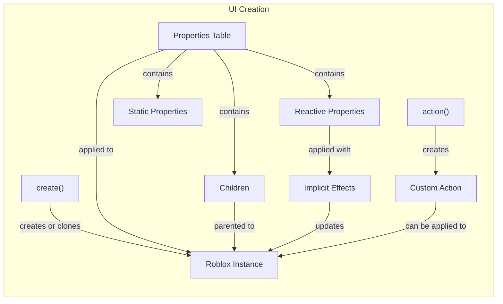

# Overview

Vide is a reactive UI library for Luau (the Roblox scripting language) that provides a declarative and concise way to build user interfaces. Inspired by [Solid.js](https://www.solidjs.com/), Vide employs a fine-grained reactivity system to efficiently update only the parts of the UI that need to change when state changes.

For installation instructions and a quick example, see [Installation and Quick Start](#1.1).

## Core Architecture

Vide's architecture is built around a reactive graph system that manages dependencies between reactive values and the effects that use them. The following diagram illustrates the main components of Vide and how they relate to each other:



Sources: [README.md](), [test/tests.luau:302-336](), [test/tests.luau:350-434]()

## Reactive System

The reactive system forms the foundation of Vide. It consists of three main components:



Sources: [test/tests.luau:36-301](), [test/tests.luau:582-636](), [test/tests.luau:435-580](), [test/tests.luau:638-717]()

### Sources

Sources are the foundation of the reactive system. They are created using the `source()` function and represent reactive state values. Sources are callable functions that both get and set values:

```lua
local count = source(0) -- Create a source with initial value 0
print(count()) -- Get the current value: 0
count(1) -- Set a new value: 1
```

When a source value changes, all effects and derivations that depend on it are automatically updated.

Sources: [test/tests.luau:350-434]()

### Derived Values

Derived values (created with `derive()`) are computed values that automatically update when their dependencies change:

```lua
local count = source(0)
local doubleCount = derive(function()
    return count() * 2
end)
```

Derivations cache their result and only recompute when their dependencies change.

Sources: [test/tests.luau:435-580]()

### Effects

Effects (created with `effect()`) are functions that run whenever their dependencies change:

```lua
effect(function()
    print("Count is now:", count())
end)
```

Effects automatically track what reactive values they use and rerun when those values change.

Sources: [test/tests.luau:582-636]()

## UI Building System

Vide provides a declarative API for creating and manipulating UI elements:



Sources: [test/tests.luau:719-1087]()

### Element Creation

The `create()` function is used to create UI elements with reactive properties:

```lua
local textLabel = create("TextLabel", {
    Text = "Hello World",
    BackgroundTransparency = 1
})

-- or with reactive properties
local textLabel = create("TextLabel", {
    Text = function() return "Count: " .. count() end
})
```

Properties can be set either as static values or as functions that automatically create reactive bindings.

Sources: [test/tests.luau:724-777](), [test/tests.luau:843-860]()

### Children Management

Vide makes it easy to create and manage UI hierarchies:

```lua
local frame = create("Frame", {
    create("TextLabel", { Text = "Title" }),
    create("TextButton", { Text = "Click me" })
})
```

You can also use reactive sources to dynamically update children:

```lua
local children = source({})
local frame = create("Frame", { children })

-- Later update children
children({ 
    create("TextLabel", { Text = "New Child" })
})
```

Sources: [test/tests.luau:803-828](), [test/tests.luau:900-928]()

## Rendering Primitives

Vide includes primitives for conditional and list rendering:

### Conditional Rendering

The `show()` function allows for conditional rendering based on a reactive source:

```lua
local visible = source(true)
local content = show(visible, function()
    return create("TextLabel", { Text = "I'm visible!" })
end)
```

The `switch()` function allows for more complex conditional logic:

```lua
local status = source("loading")
local display = switch(status) {
    ["loading"] = function() return create("TextLabel", { Text = "Loading..." }) end,
    ["error"] = function() return create("TextLabel", { Text = "Error!" }) end,
    ["success"] = function() return create("TextLabel", { Text = "Success!" }) end
}
```

Sources: [test/tests.luau:1089-1283](), [test/tests.luau:1285-1409]()

### List Rendering

The `indexes()` and `values()` functions provide efficient ways to render lists of data:

```lua
local items = source({ "Item 1", "Item 2", "Item 3" })
local listItems = indexes(items, function(itemSource, index)
    return create("TextLabel", {
        Text = function() return itemSource() end,
        LayoutOrder = index
    })
end)
```

Sources: [test/tests.luau:1411-1571]()

## Advanced Features

Vide includes several advanced features that enhance the development experience:

### Animation System

The `spring()` function provides physics-based animations that integrate with the reactive system:

```lua
local position = spring(UDim2.fromScale(0, 0))
local frame = create("Frame", {
    Position = position
})

-- Animate to a new position
position(UDim2.fromScale(0.5, 0.5))
```

### Context System

The `context()` function provides a way to pass data through the component tree without prop drilling:

```lua
local ThemeContext = context("light")

-- Provider
root(function()
    ThemeContext.Provider("dark", function()
        -- Components inside can access the theme
    end)
end)

-- Consumer
effect(function()
    local theme = ThemeContext.Consumer()
    print("Current theme:", theme)
end)
```

### Batch Updates

The `batch()` function allows multiple updates to be batched together for better performance:

```lua
batch(function()
    count1(count1() + 1)
    count2(count2() + 1)
    -- Only one update cycle will happen
})
```

Sources: [CHANGELOG.md:70-71](), [CHANGELOG.md:53-54]()

## Basic Usage Example

Here's a simple counter example demonstrating Vide's core concepts:

```lua
local create = vide.create
local source = vide.source

local function Counter()
    local count = source(0)

    return create("TextButton", {
        Text = function() return "Count: " .. count() end,
        Activated = function() count(count() + 1) end
    })
end

-- Mount the counter to a ScreenGui
local screenGui = create("ScreenGui", {})
local destroy = vide.mount(Counter, screenGui)

-- Later, to clean up
destroy()
```

Sources: [README.md:19-38](), [test/tests.luau:302-334]()

## Memory Management and Cleanup

Vide provides a robust cleanup system to prevent memory leaks. The `cleanup()` function registers actions to be performed when a reactive scope is destroyed:

```lua
effect(function()
    local connection = someInstance.SomeEvent:Connect(function() end)
    cleanup(connection) -- Will be disconnected automatically
end)
```

The `root()` function creates a stable scope for reactive computations, which can be manually destroyed:

```lua
local destroy = root(function()
    -- Reactive code here
end)

-- Later
destroy() -- Clean up all reactive nodes created in the scope
```

Sources: [test/tests.luau:638-717](), [test/tests.luau:335-348]()
